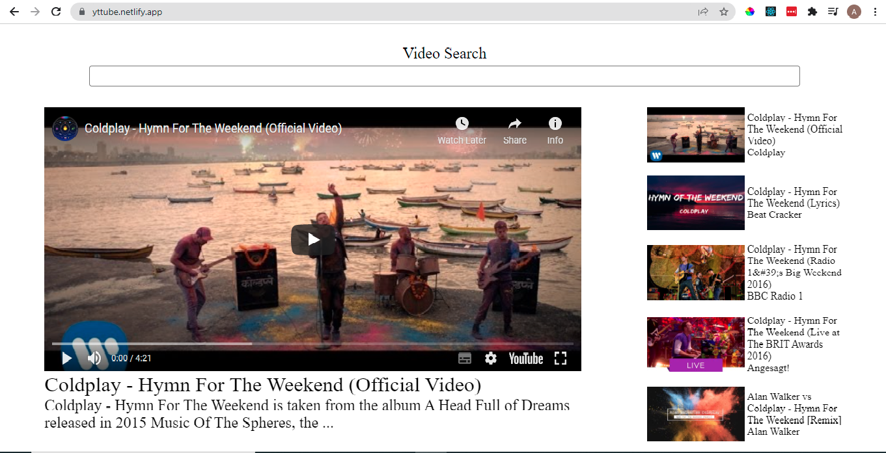

## Table of contents

- [The challenge](#the-challenge)
- [Screenshot](#screenshot)
- [Links](#links)
- [Built with](#built-with)
- [Author](#author)

### The challenge

Users should be able to:

- View the optimal layout for the site depending on their device's screen size

### Screenshot

### Links

- Solution URL: [Solution](https://github.com/atinderbirsin/yt-app)
- Live Site URL: [Live Site](https://yttube.netlify.app/)

### Built with

- React
- CSS custom properties
- Flexbox
- CSS Grid

## Author

- Website - [Atinder](https://github.com/atinderbirsin)
- Frontend Mentor - [@atinderbirsin](https://www.frontendmentor.io/profile/atinderbirsin)
